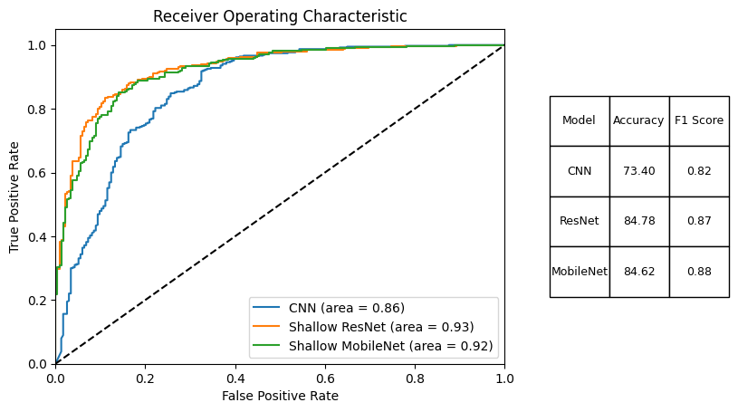

# Interpretable AI: Classification of X-ray Images

## Introduction

The primary goal of this project is to develop an interoperable framework for classifying X-ray images using multiple Convolutional Neural Network (CNN) models. Emphasis is placed on the ease of switching between different models, comparing their performance, and the ability to visualise and understand the models' decision-making process. In this report, we present the methodology, results, and insights obtained during the project.

## Data Preparation and Preprocessing

### Dataset
The dataset used in this project consists of X-ray images with labels indicating the presence or absence of a specific condition. The dataset is divided into a training set and a test set to ensure proper model evaluation.

Dataset can be found [here](https://www.kaggle.com/datasets/paultimothymooney/chest-xray-pneumonia).

### Preprocessing
Prior to training the CNN models, the images are preprocessed by resizing, normalising, and augmenting the dataset. The data augmentation techniques applied include rotation, flipping, and zooming. This step helps to increase the dataset's size and diversity, reducing the risk of overfitting and improving the model's generalisation capabilities.

## Methodology

### Interoperable Framework
To facilitate the interoperability of various CNN models, we have designed a unified interface for training and evaluation. This interface allows seamless switching between models and easy comparison of their performance. The framework is designed to handle popular CNN architectures such as 2-layer CNN, ResNet, and MobileNet.

### CNN Models
For this project, we have chosen to focus on the following CNN models:

1. 2-layer CNN
2. ResNet
3. Shallow MobileNet

These models were chosen due to their popularity, proven performance in image classification tasks, and diverse architectural design. This variety allows for a thorough comparison and assessment of their suitability for X-ray image classification.

### Training and Model Performance:
Each of the selected CNN models is trained using the preprocessed training dataset. The models' performance is then evaluated on the test dataset to determine their accuracy, loss, and other relevant metrics. The three methods had relatively similar performance on the datasets:

## Model Comparison and Insights

### Model Interpretability and Visualisation
To gain insights into the decision-making process of the CNN models, we employ visualisation techniques to analyse the attributions of individual layers. This helps to identify the regions in the input images that the models find most relevant for classification.

The above visualization shows the Integrated Gradients for the ResNet model. Integrated Gradients is a feature attribution method that highlights the regions of the input image that contribute the most to the model's prediction. In this case, the highlighted areas correspond to the regions where the model identifies patterns associated with pneumonia.

To further investigate the decision-making process of the CNN models, we also employ the Grad-CAM visualization technique. Grad-CAM, or Gradient-weighted Class Activation Mapping, is a method that highlights the important regions in an input image based on the gradients of the target class flowing into the ResNet layer by layer. This insight can provide valuable information about the hierarchical nature of feature extraction in CNNs and help us further understand the model's decision-making process at different stages of its architecture.

By examining the visualization, we can observe that the ResNet model is focusing on specific areas within the lung, which are likely to be indicative of pneumonia. This information can help us gain a better understanding of the model's decision-making process and potentially improve the model by fine-tuning its architecture or training strategies. Furthermore, such visualizations can be used to assess the reliability of the model and validate its predictions, ensuring a higher level of confidence when using the model for medical diagnoses.

## Conclusion

The project successfully demonstrates the development of an interoperable framework for classifying X-ray images using multiple CNN models. The unified interface enables easy model switching and performance comparison, allowing for more informed decisions when selecting a suitable model for a given task. The visualisation techniques employed in this project provide valuable insights into the models' decision-making processes, further enhancing our understanding of the models and improving their interpretability.